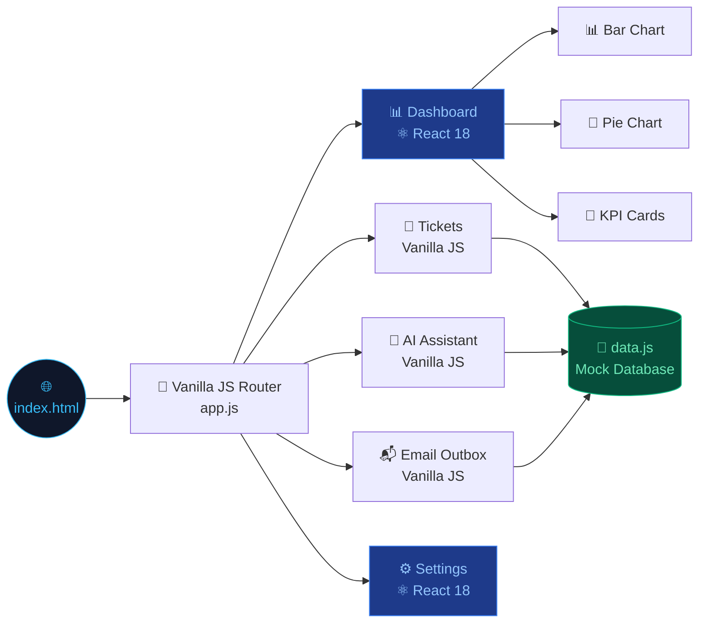
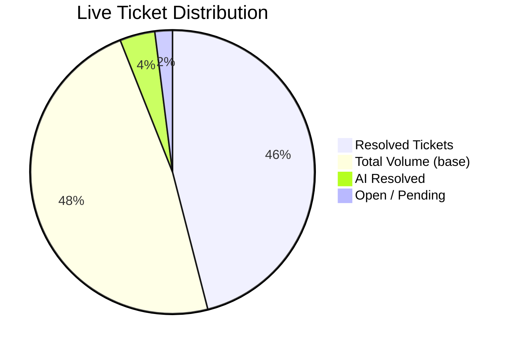
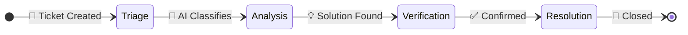

<!-- HEADER BANNER -->

<div align="center">


</div>


<div align="center">


[](https://reactjs.org/)

[](https://developer.mozilla.org/en-US/docs/Web/JavaScript)

[](https://developer.mozilla.org/en-US/docs/Web/HTML)

[](.)

[](.)


</div>


<br>


<div align="center">

  <h3>

    🎫 Automated Triage &nbsp;•&nbsp; 🤖 AI Resolution &nbsp;•&nbsp; 📊 Live Analytics &nbsp;•&nbsp; 📬 Email Automation

  </h3>

</div>


---


> 💡 **SupportPilot** is an enterprise-grade helpdesk SPA featuring AI-powered ticket triage, stateful React dashboards, real-time telemetry charts, and a built-in email outbox — all running in the browser with **zero dependencies or build tools**.


---


## 📑 Table of Contents


| # | Section |

|---|---|

| 1 | [🏗️ Architecture](#%EF%B8%8F-architecture--technology-stack) |

| 2 | [📂 File Structure](#-repository-structure) |

| 3 | [✨ Feature Breakdown](#-feature-breakdown) |

| 4 | [📱 Mobile Responsive](#-mobile-responsiveness) |

| 5 | [🎨 Design System](#-design-system) |

| 6 | [🚀 Getting Started](#-getting-started) |


---


## 🆕 Recent Updates


<p>🟣 <strong>Mobile Sidebar</strong> — Hamburger ☰ button opens the sidebar on phones; a ✕ close button and dark overlay dismiss it</p>

<p>🟠 <strong>Multicolor Bar Chart</strong> — Each bar in the SLA chart has its own distinct color (Red, Orange, Yellow, Green, Cyan, Blue, Purple)</p>

<p>🔵 <strong>Show Data Toggle</strong> — Both Bar Chart and Pie Chart now have a "Show Data" / "Back" button to flip between visual and table views</p>

<p>🟢 <strong>Larger Charts</strong> — Bar chart height increased to 200px, Pie chart enlarged to 130px</p>

<p>🔴 <strong>Ticket Data Cleared</strong> — Initial mock tickets (TKT-1001, TKT-1002, TKT-1003) removed so the workspace starts fresh</p>

<p>📖 <strong>README Overhaul</strong> — Full documentation rewrite with wave banners, Mermaid diagrams, colored bullet points, file tree, and changelog</p>


---


## 🏗️ Architecture & Technology Stack


<div align="center">





</div>


<br>


<div align="center">


| 🔷 Layer | 🛠️ Technology | 📋 What it does |

|:---:|:---:|:---|

| **UI Components** | ⚛️ React 18 (CDN) | Dashboard charts, KPI cards, Settings panel |

| **Routing & Logic** | 🟡 Vanilla JS | Navigation, ticket management, email |

| **Styling** | 🎨 CSS3 Variables | Theming, glassmorphism, animations |

| **Data** | 💾 Mock JS Object | In-memory ticket database (no backend!) |


</div>


---


## 📂 Repository Structure


```

📁 Ticket-Management/

│

├── 📁 css/

│   └── 🎨 styles.css           ← Global theme, CSS variables, animations

│

├── 📁 js/

│   ├── ⚛️ dashboard-react.js   ← React: Bar Chart, Pie Chart, KPI Cards

│   ├── ⚛️ settings-react.js    ← React: Profile editor, theme switcher

│   ├── 🧭 app.js               ← Router, nav, theme engine

│   ├── 💾 data.js              ← Mock database (tickets, users)

│   ├── 🎫 tickets.js           ← Table, filters, drawer, CSV export

│   ├── 💬 assistant.js         ← AI chat interface

│   ├── 📬 email.js             ← Email inbox simulator

│   └── ⚙️ settings.js          ← Settings bridge & sync

│

├── 📁 .github/workflows/

│   └── 🔄 static.yml           ← GitHub Pages auto-deploy

│

├── 🌐 index.html               ← SPA shell, all views, CDN scripts

└── 📖 README.md

```


---


## ✨ Feature Breakdown


### 📊 1 — Dashboard View *(⚛️ React Powered)*


<div align="center">





</div>


> The command centre of SupportPilot — built entirely in **React 18** for lightning-fast, stateful rendering.


<br>


<p>🔴 <strong>KPI Cards</strong> — Four live metric tiles: <em>Total Tickets, Open, Resolved, AI Resolution Rate</em> — each with a week-over-week trend arrow</p>

<p>🟠 <strong>Bar Chart (SLA Trend)</strong> — 7-day performance chart with <strong>unique color per bar</strong>. Toggle between the visual chart and raw data table using <strong>"Show Data" / "Back"</strong> buttons</p>

<p>🟡 <strong>Pie Chart (Categories)</strong> — Colorful donut chart. Click any slice to highlight it and see the value inside the ring</p>

<p>🟢 <strong>Quick Actions</strong> — One-click shortcuts to <em>Create Ticket</em> and <em>Open AI Assistant</em></p>

<p>🔵 <strong>Recent Activity</strong> — Live table of the 5 most recent system events</p>


---


### 🎫 2 — Incidents Workspace *(Tickets View)*


<p>🔴 <strong>Smart Search</strong> — Real-time filter across Ticket ID, reporter name, and subject</p>

<p>🟠 <strong>Column Sorting</strong> — Click any header to sort ascending/descending by ID, User, Subject, Priority, or Status</p>

<p>🟡 <strong>Dropdown Filters</strong> — Narrow results by Department, Severity Level, or Ticket Status</p>

<p>🟢 <strong>Slide-Out Drawer</strong> — Click any row to open a full detail panel with ticket history, AI classification, suggested resolution, and attachments</p>

<p>🔵 <strong>Action Buttons</strong> — Resolve, Escalate, or Re-assign directly from within the drawer</p>

<p>🟣 <strong>CSV Export</strong> — One-click download of the current filtered data set</p>


---


### 💬 3 — AI Diagnostics Copilot *(Assistant View)*


<p>🔴 <strong>Chat Interface</strong> — Type any IT/helpdesk question and receive a simulated AI response</p>

<p>🟠 <strong>Diagnostic Templates</strong> — Pre-built queries for VPN, Authentication, Billing, and Account issues</p>

<p>🟢 <strong>Ticket Context</strong> — Responses are informed by the live ticket database for relevant suggestions</p>


---


### ⚙️ 4 — Agent Workflow Simulator


<div align="center">





</div>


<p>🔴 <strong>Triage</strong> — AI auto-classifies by category, department, and priority</p>

<p>🟠 <strong>Analysis</strong> — Searches the knowledge base for a resolution match</p>

<p>🟡 <strong>Verification</strong> — Validates the solution meets quality thresholds</p>

<p>🟢 <strong>Resolution</strong> — Ticket closes automatically and a confirmation email is dispatched</p>


---


### 📬 5 — Email Outbox Orchestrator


<p>🔵 <strong>Email Queue</strong> — Chronological list of all automated emails sent on ticket events</p>

<p>🟣 <strong>Template Composer</strong> — Canned templates: Ticket Received, Under Investigation, Resolved</p>

<p>🟠 <strong>Delivery Timeline</strong> — Full audit trail with timestamps for every email event</p>


---


### 🛠️ 6 — Settings Panel *(⚛️ React Powered)*


<p>🔴 <strong>Profile Customizer</strong> — Update display name and avatar color; changes reflect in the sidebar and navbar instantly via React state</p>

<p>🟡 <strong>Dark / Light Mode</strong> — Toggles the full app theme in one click using CSS variable swapping</p>

<p>🟢 <strong>System Preferences</strong> — Configure AI confidence thresholds, SLA alert targets, and auto-escalation rules</p>


---


## 🎨 Design System


<div align="center">


| Design Token | Value | Effect |

|:---:|:---:|:---|

| `--accent-primary` | `#2563eb` | Buttons, links, active states |

| `--bg-card` | `#1e2433` (dark) | Card & panel backgrounds |

| `--text-muted` | `#64748b` | Secondary labels & metadata |

| `--border-color` | `rgba(255,255,255,0.08)` | Subtle borders |


</div>


<p>🔴 <strong>CSS Variables</strong> — All colors defined as custom properties; theme changes cascade instantly</p>

<p>🟠 <strong>Glassmorphism</strong> — Frosted-glass `backdrop-filter: blur()` on modals, drawers, and overlays</p>

<p>🟡 <strong>Micro-Animations</strong> — CSS `transition` on every interactive element: hovers, drawer slides, toast fades</p>

<p>🟢 <strong>Curated Palette</strong> — HSL-tuned harmonious colors — no plain defaults</p>

<p>🔵 <strong>CSS Grid + Flexbox</strong> — Fully responsive, clean multi-column layouts</p>


---


## 📱 Mobile Responsiveness


<p>🟢 <strong>Responsive Layout</strong> — The entire app scales cleanly on screens ≤768px; the sidebar hides and content takes full width</p>

<p>🔴 <strong>Hamburger Button ☰</strong> — Located in the top navbar on mobile; tap it to slide the sidebar in from the left with a smooth animation</p>

<p>🟡 <strong>✕ Close Button</strong> — Appears inside the sidebar header on mobile only; tap it to dismiss the menu</p>

<p>🔵 <strong>Dark Overlay Backdrop</strong> — A blurred dark overlay appears behind the open sidebar; tapping it also closes the menu</p>

<p>🟠 <strong>Auto-Close on Navigate</strong> — Tapping any nav item automatically closes the sidebar so you get straight to the content</p>

<p>🟣 <strong>KPI Grid Stacks</strong> — On phones the 4-column KPI card grid stacks to 2 columns, then 1 column on very small screens</p>

<p>📋 <strong>Scrollable Tables</strong> — The tickets table scrolls horizontally on mobile so no data is ever cut off</p>


---


## 🚀 Getting Started


<p>🟢 <strong>Step 1</strong> — Clone or download the repository</p>


```bash

git clone https://github.com/your-username/Ticket-Management.git

```


<p>🔵 <strong>Step 2</strong> — Open <code>index.html</code> in any modern browser</p>


```bash

# Windows

start index.html


# Mac / Linux

open index.html

```


<p>🟣 <strong>Step 3</strong> — Explore the full React-powered dashboard!</p>


> 💡 **Pro Tip:** Install the **Live Server** extension in VS Code and click *"Go Live"* for hot-reload during development.


---


<!-- FOOTER -->

<div align="center">


*Built with ❤️ using **React 18**, **Vanilla JS**, and **CSS3***


</div>

